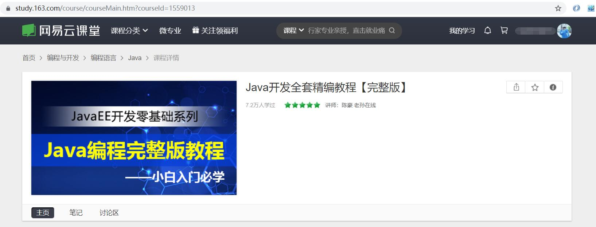

# 🌈 Java 学习 之 *基础知识点大集合*

#### 网易云课堂链接：

Java开发全套精编教程【完整版】  https://study.163.com/course/introduction.htm?courseId=1559013#/courseDetail?tab=1
 

    

## 📚 目录

+ ### [java 基础语法](/Basic%20Grammar)
    + [java 基本说明](/Basic%20Grammar/章节1.md)
    + [数据类型](/master/Basic%20Grammar/章节2.md)
    + [运算符](/Basic%20Grammar/章节3.md)
    + [条件语句](/Basic%20Grammar/章节4.md)
    + [循环语句](/Basic%20Grammar/章节5.md)
    + [数组](/Basic%20Grammar/章节6.md)
+ ### [面向对象编程](#)
    + [类和对象](#)
    + [封装](#)
    + [继承](#)
    + [多态](#)
    + [抽象类和接口](#)
+ ### [内部类](#)
    + [成员内部类](#)
    + [静态内部类](#)
    + [匿名内部类](#)
    + [局部内部类](#)
+ ### [java 异常](#)
+ ### [泛型类](#)
+ ### [集合](#)
    + [java 集合框架](#)
    + [Iterable 接口和迭代器](#)
    + [Collection 接口](#)
    + [List、Set、Map](#)
+ ### [GUI 编程](#)
+ ### [反射](#)
    + [反射概述](#)
    + [反射 API](#)
    + [案例讲解](#)
+ ### [多线程](#)
    + [线程模型](#)
    + [线程生命周期](#)
    + [多线程编程](#)
    + [线程通信](#)
+ ### [IO 流](#)
    + [IO 框架](#)
    + [字节流](#)
    + [多线程编程](#)
    + [线程通信](#)
+ ### [网络编程](#)
+ ### [Java 新特性](#)
+ ### [XML](#)
+ ### [Java 数据库基础](#)
    + [sqlite 数据库概述](#)
    + [基本 SQL 语句](#)
    + [JDBC API（java 程序访问数据库）](#)
    + [大数据](#)